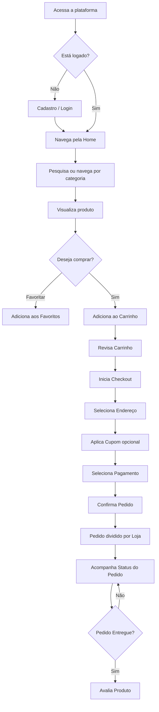
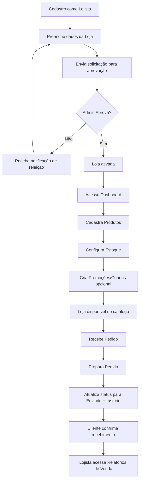
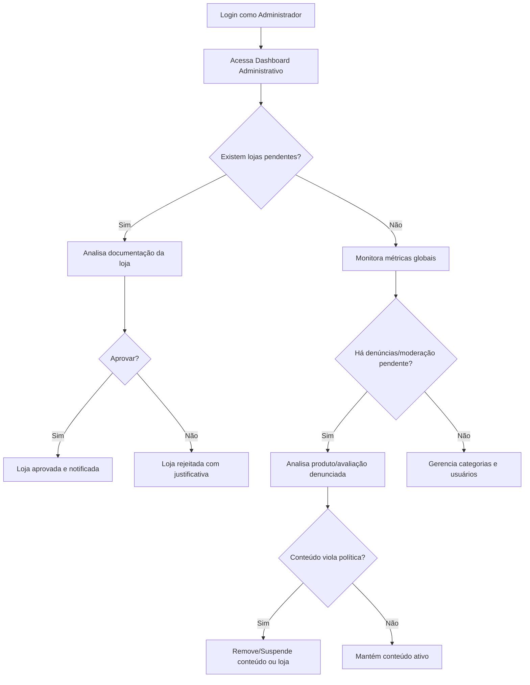

# PRD — Marketplace Multi-Lojas
### Product Requirements Document

**Versão:** 1.0
**Data:** Agosto de 2026
**Autor:** Product Management
**Status:** Em elaboração — para validação com stakeholders
**Stack Tecnológica:** HTML, CSS, JavaScript, Supabase (PostgreSQL, Auth, Storage, Realtime, Edge Functions)

---

## Sumário

1. Visão Geral
2. Personas
3. Requisitos Funcionais
4. Requisitos Não Funcionais
5. Fluxo do Usuário
6. Banco de Dados
7. Regras de Negócio
8. APIs
9. Estrutura de Pastas
10. Roadmap
11. Critérios de Aceitação
12. Melhorias Futuras

---

# 1. Visão Geral

## 1.1 Objetivo do Produto

O produto é um **marketplace web multi-lojas**, uma plataforma de e-commerce que permite que múltiplos lojistas independentes se cadastrem, configurem suas próprias lojas virtuais e comercializem produtos para consumidores finais dentro de um único ecossistema digital centralizado. A plataforma atua como intermediária entre a oferta (lojistas) e a demanda (clientes), oferecendo infraestrutura tecnológica de catálogo, busca, carrinho, checkout, pagamento, gestão de pedidos e relacionamento com o cliente, sem que cada lojista precise desenvolver sua própria loja do zero.

O objetivo de negócio é criar um ambiente de comércio eletrônico **rápido, moderno, responsivo e confiável**, que reduza a barreira de entrada para pequenos e médios lojistas venderem online, ao mesmo tempo em que oferece aos clientes finais uma experiência de compra unificada, com múltiplas opções de produtos, lojas e categorias em um único lugar — similar ao modelo adotado por Mercado Livre, Amazon Marketplace, Shopee e Shopify (no papel de plataforma habilitadora, não de loja única).

## 1.2 Problema que Resolve

| Problema | Descrição |
|---|---|
| Alto custo de entrada para lojistas | Pequenos lojistas não têm recursos para desenvolver e manter uma loja virtual própria, com infraestrutura de pagamento, segurança e hospedagem. |
| Fragmentação da experiência de compra | Clientes precisam navegar por dezenas de sites diferentes para comparar produtos e preços. |
| Falta de confiança em lojas isoladas | Lojas desconhecidas e sem histórico geram insegurança no consumidor (fraude, não entrega, produto divergente). |
| Ausência de padronização operacional | Lojistas sem processos definidos de estoque, pedidos e atendimento perdem vendas e geram experiências ruins. |
| Dificuldade de descoberta | Produtos de pequenos lojistas têm baixa visibilidade em buscadores tradicionais, dificultando a aquisição de clientes. |

A plataforma resolve esses problemas ao oferecer uma **infraestrutura compartilhada, confiável e padronizada**, reduzindo custos operacionais e técnicos para os lojistas, e centralizando a oferta para os clientes, aumentando a conveniência, a variedade e a confiança (por meio de avaliações, políticas de moderação e aprovação de lojas).

## 1.3 Público-Alvo

1. **Clientes (compradores)** — pessoas físicas que desejam comprar produtos online com praticidade, variedade de opções e segurança.
2. **Lojistas (vendedores)** — pessoas físicas (MEI, autônomos) ou jurídicas (pequenas e médias empresas) que desejam vender produtos online sem precisar construir uma loja própria.
3. **Administradores da plataforma** — equipe interna responsável por operar, moderar, aprovar e garantir a saúde comercial e técnica do marketplace.

## 1.4 Benefícios

**Para clientes:**
- Variedade de produtos e lojas em um único checkout.
- Comparação facilitada de preços e avaliações.
- Segurança nas transações e políticas claras de reembolso/cancelamento.
- Experiência responsiva, rápida e acessível em qualquer dispositivo.

**Para lojistas:**
- Redução de custo e tempo de implementação de uma loja própria.
- Dashboard completo de gestão de produtos, estoque, pedidos e relatórios.
- Acesso a uma base de clientes maior do que a alcançável isoladamente.
- Ferramentas de marketing (cupons, promoções) inclusas na plataforma.

**Para a plataforma (negócio):**
- Monetização via comissão sobre vendas, planos de assinatura para lojistas ou destaque pago.
- Escalabilidade horizontal (mais lojistas = mais produtos = mais clientes).
- Dados centralizados para inteligência de mercado e recomendação.

---

# 2. Personas

## 2.1 Persona — Cliente

**Nome:** Fernanda Alves
**Idade:** 29 anos
**Ocupação:** Analista de Marketing
**Perfil tecnológico:** Alta familiaridade digital, compra frequentemente por celular.

**Objetivos:**
- Encontrar produtos com bom custo-benefício rapidamente.
- Comparar preços entre diferentes lojas dentro da mesma plataforma.
- Ter segurança na compra (avaliações, políticas de devolução).
- Acompanhar o status do pedido em tempo real.

**Frustrações:**
- Sites lentos ou que travam durante o checkout.
- Falta de clareza sobre prazos de entrega por loja.
- Processos de devolução burocráticos.

**Necessidades da plataforma:**
- Busca eficiente com filtros por categoria, preço e avaliação.
- Checkout simplificado (idealmente em poucos cliques).
- Histórico de pedidos e rastreamento.

---

## 2.2 Persona — Lojista

**Nome:** Carlos Eduardo Ramos
**Idade:** 41 anos
**Ocupação:** Proprietário de uma loja de artigos esportivos (pequena empresa, 3 funcionários)
**Perfil tecnológico:** Conhecimento básico a intermediário de ferramentas digitais.

**Objetivos:**
- Vender seus produtos sem precisar programar ou manter um site próprio.
- Gerenciar estoque e pedidos de forma simples e centralizada.
- Criar promoções e cupons para aumentar vendas em datas específicas.
- Entender o desempenho da loja por meio de relatórios.

**Frustrações:**
- Plataformas complexas que exigem conhecimento técnico avançado.
- Falta de visibilidade sobre pedidos pendentes ou estoque baixo.
- Comissões altas ou pouco transparentes.

**Necessidades da plataforma:**
- Dashboard intuitivo com visão geral de vendas, pedidos e estoque.
- Cadastro de produtos rápido, com upload de múltiplas imagens.
- Relatórios de vendas e desempenho por produto.

---

## 2.3 Persona — Administrador

**Nome:** Juliana Torres
**Idade:** 34 anos
**Ocupação:** Gerente de Operações da plataforma
**Perfil tecnológico:** Alto domínio de ferramentas administrativas e painéis de controle.

**Objetivos:**
- Garantir que apenas lojas confiáveis operem na plataforma.
- Moderar conteúdo impróprio (produtos proibidos, descrições enganosas).
- Monitorar a saúde geral do marketplace (vendas, usuários ativos, disputas).
- Gerenciar categorias e organização do catálogo geral.

**Frustrações:**
- Processos manuais de aprovação de lojas sem histórico auditável.
- Falta de ferramentas de moderação em massa.
- Dificuldade de identificar fraudes ou comportamento suspeito.

**Necessidades da plataforma:**
- Painel administrativo completo com métricas globais.
- Fluxo de aprovação/rejeição de lojas com justificativa.
- Ferramentas de moderação de produtos e avaliações.

---

# 3. Requisitos Funcionais

## 3.1 Autenticação

### RF-01 — Cadastro de Usuário
- O sistema deve permitir cadastro via e-mail e senha, utilizando Supabase Auth.
- Deve haver validação de e-mail único e formato válido.
- Senha deve exigir no mínimo 8 caracteres, com letras e números.
- Após o cadastro, um e-mail de confirmação deve ser enviado (Supabase Auth email confirmation).
- No cadastro, o usuário escolhe o tipo de perfil inicial: **Cliente** (padrão) ou solicita conversão para **Lojista** posteriormente.
- Cadastro social (Google) pode ser suportado via Supabase OAuth (item de melhoria futura, ver seção 12).

### RF-02 — Login
- Login via e-mail/senha utilizando `supabase.auth.signInWithPassword`.
- Mensagens de erro específicas: credenciais inválidas, e-mail não confirmado, conta bloqueada.
- Sessão persistente via JWT (token gerenciado pelo Supabase Auth), com refresh automático.
- Redirecionamento condicional pós-login conforme o tipo de perfil (cliente, lojista, admin).

### RF-03 — Recuperação de Senha
- Fluxo de "Esqueci minha senha" via `supabase.auth.resetPasswordForEmail`.
- Envio de link de redefinição com expiração (padrão Supabase: 1 hora).
- Página dedicada para definição de nova senha, validando os mesmos critérios do cadastro.

### RF-04 — Perfil
- Usuário pode editar: nome completo, telefone, foto de perfil, endereços (múltiplos).
- Cliente pode gerenciar endereços de entrega (adicionar, editar, excluir, definir padrão).
- Lojista possui campos adicionais vinculados à loja (ver seção 3.3).
- Exclusão de conta (soft delete, mantendo histórico de pedidos por obrigações fiscais).

---

## 3.2 Clientes

### RF-05 — Pesquisa
- Campo de busca textual com busca full-text (Postgres `tsvector`/`pg_trgm` via Supabase) sobre nome e descrição de produtos.
- Sugestões de autocomplete em tempo real.
- Ordenação de resultados por: relevância, menor preço, maior preço, mais vendidos, melhor avaliados, mais recentes.
- Filtros combináveis: categoria, faixa de preço, loja, avaliação mínima, disponibilidade em estoque.

### RF-06 — Categorias
- Listagem hierárquica de categorias (categoria e subcategoria).
- Página de categoria exibindo produtos filtráveis e paginados.
- Categorias em destaque na home (definidas pelo administrador).

### RF-07 — Favoritos
- Cliente pode marcar/desmarcar produtos como favoritos (ícone de coração).
- Página "Meus Favoritos" com listagem e opção de mover para o carrinho.
- Notificação opcional de queda de preço em item favoritado (melhoria futura).

### RF-08 — Carrinho
- Adição/remoção de produtos, com seleção de quantidade.
- Carrinho segmentado visualmente por loja (pois o pedido pode ser dividido em múltiplos sub-pedidos por lojista).
- Persistência do carrinho entre sessões (associado ao `user_id` autenticado; para visitantes, persistência local via `localStorage`).
- Validação de estoque disponível ao adicionar/atualizar item.
- Cálculo dinâmico de subtotal, frete estimado (por loja) e total geral.

### RF-09 — Checkout
- Revisão do pedido dividido por loja (cada loja gera um sub-pedido/`pedido` independente vinculado a um `pedido_pai` ou agrupador de compra).
- Seleção/cadastro de endereço de entrega.
- Seleção de método de pagamento (estrutura preparada para integração — ver seção 12 sobre Pix/Cartão).
- Aplicação de cupons de desconto (por loja ou globais da plataforma).
- Confirmação final com resumo de valores (produtos, frete, descontos, total).
- Geração de número de pedido único por sub-pedido.

### RF-10 — Pedidos
- Cliente visualiza lista de pedidos com status: `aguardando_pagamento`, `pago`, `em_preparacao`, `enviado`, `entregue`, `cancelado`.
- Detalhe do pedido com itens, valores, endereço de entrega e status de rastreio.
- Solicitação de cancelamento (respeitando regras de negócio, seção 7).

### RF-11 — Avaliações
- Cliente pode avaliar produtos comprados (nota de 1 a 5 estrelas + comentário opcional).
- Avaliação só é liberada após status do pedido = `entregue`.
- Exibição de média de avaliações e distribuição por estrelas na página do produto.
- Lojista pode responder publicamente a uma avaliação (sem poder excluí-la).

### RF-12 — Histórico
- Histórico completo de compras, com filtro por período e loja.
- Opção de "comprar novamente" a partir do histórico.

---

## 3.3 Lojistas

### RF-13 — Cadastro da Loja
- Formulário de solicitação de loja: nome fantasia, CNPJ/CPF, descrição, categoria principal, telefone, endereço de retirada/despacho, logo e banner.
- Status inicial da loja: `pendente` (aguardando aprovação do administrador).
- Upload de documentos (opcional/obrigatório conforme política de compliance) via Supabase Storage.

### RF-14 — Dashboard do Lojista
- Visão geral: vendas do dia/mês, pedidos pendentes, produtos com estoque baixo, avaliação média da loja.
- Gráficos de vendas ao longo do tempo (linha) e por produto (barra).
- Acesso rápido às áreas de produtos, pedidos, cupons e relatórios.

### RF-15 — Cadastro de Produtos
- Campos: nome, descrição, categoria, preço, preço promocional (opcional), SKU, peso/dimensões (para frete), múltiplas imagens.
- Upload de imagens via Supabase Storage com geração de URLs públicas.
- Ativação/desativação de produto (visibilidade no catálogo) sem exclusão permanente.
- Duplicar produto para agilizar cadastro de itens similares.

### RF-16 — Estoque
- Controle de quantidade disponível por produto (e, futuramente, por variação — tamanho/cor).
- Alertas de estoque baixo (limite configurável pelo lojista).
- Baixa automática de estoque na confirmação do pedido; devolução automática em caso de cancelamento.
- Histórico de movimentações de estoque (entrada/saída) para auditoria.

### RF-17 — Promoções
- Criação de promoções com desconto percentual ou valor fixo, aplicáveis a produtos específicos ou à loja toda.
- Definição de período de vigência (data início/fim).
- Selo visual de "Promoção" no catálogo.

### RF-18 — Cupons
- Criação de cupons com código único, tipo de desconto (percentual/fixo), valor mínimo de compra, limite de uso total e por cliente, data de expiração.
- Cupons podem ser restritos à loja emissora ou (para cupons administrativos) válidos em toda a plataforma.
- Validação de cupom em tempo real no checkout.

### RF-19 — Relatórios
- Relatório de vendas por período, por produto e por categoria.
- Relatório de produtos mais vendidos e menos vendidos.
- Exportação de relatórios (CSV) — melhoria a partir da v1.1.

### RF-20 — Pedidos (visão do lojista)
- Listagem de pedidos recebidos com filtro por status.
- Atualização de status: `em_preparacao` → `enviado` (com inserção de código de rastreio) → aguardando confirmação de `entregue`.
- Aceite ou recusa de cancelamento solicitado pelo cliente, conforme regras de negócio.

### RF-21 — Clientes (visão do lojista)
- Listagem de clientes que já compraram na loja, com histórico de pedidos consolidado.
- Não deve expor dados sensíveis além do necessário para operação (LGPD — ver seção 4).

---

## 3.4 Administrador

### RF-22 — Gestão de Usuários
- Listagem de todos os usuários (clientes, lojistas, admins) com filtros de busca.
- Bloqueio/desbloqueio de contas.
- Alteração de papel (role) de usuário quando necessário.

### RF-23 — Gestão de Lojas
- Listagem de todas as lojas com status (`pendente`, `aprovada`, `suspensa`, `rejeitada`).
- Edição/força de suspensão de loja em caso de violação de política.

### RF-24 — Gestão de Categorias
- CRUD completo de categorias e subcategorias.
- Reordenação de categorias em destaque na home.

### RF-25 — Aprovação de Lojas
- Fluxo de análise de solicitação de loja com visualização de documentos enviados.
- Aprovação ou rejeição com justificativa obrigatória em caso de rejeição.
- Notificação automática ao lojista sobre o resultado (e-mail/in-app).

### RF-26 — Moderação
- Moderação de produtos denunciados (conteúdo impróprio, categoria incorreta, preço abusivo).
- Moderação de avaliações denunciadas (spam, ofensa, conteúdo falso).
- Registro de log de ações administrativas para auditoria.

### RF-27 — Dashboard Administrativo
- Métricas globais: GMV (volume total transacionado), número de pedidos, número de lojas ativas, número de usuários ativos.
- Ranking de lojas por faturamento.
- Indicadores operacionais: pedidos com disputas abertas, lojas pendentes de aprovação.

---

# 4. Requisitos Não Funcionais

| Categoria | Requisito |
|---|---|
| **Segurança** | Autenticação via Supabase Auth (JWT); Row Level Security (RLS) habilitado em todas as tabelas sensíveis; senhas nunca armazenadas em texto plano (gerenciado pelo Supabase); proteção contra SQL Injection via uso exclusivo do client Supabase (sem queries SQL concatenadas manualmente no frontend); HTTPS obrigatório em todo o tráfego; validação de inputs no frontend e reforçada por *policies* no backend; conformidade com a LGPD (consentimento de dados, direito à exclusão/portabilidade). |
| **Performance** | Tempo de carregamento inicial da home abaixo de 2,5s (em conexão 4G); paginação obrigatória em listagens com mais de 20 itens; lazy loading de imagens; uso de índices no banco para colunas de busca e filtro frequentes; cache de consultas de catálogo (categorias, produtos em destaque) no client-side. |
| **Responsividade** | Layout mobile-first, com breakpoints para mobile (≤576px), tablet (577–991px) e desktop (≥992px); componentes de UI adaptativos (grid de produtos, menus colapsáveis). |
| **Acessibilidade** | Conformidade com WCAG 2.1 nível AA; uso de HTML semântico; atributos `alt` obrigatórios em imagens de produto; contraste de cores adequado; navegação completa via teclado; suporte a leitores de tela nos formulários críticos (checkout, cadastro). |
| **SEO** | URLs amigáveis (`/produto/nome-do-produto`, `/loja/nome-da-loja`); meta tags dinâmicas (title, description, Open Graph) por página de produto/loja; dados estruturados (Schema.org `Product`, `Offer`, `AggregateRating`); sitemap.xml gerado dinamicamente; renderização de conteúdo crítico acessível a crawlers (evitar dependência 100% client-side para conteúdo indexável). |
| **Escalabilidade** | Arquitetura desacoplada (frontend estático + Supabase como BaaS), permitindo escalar o backend horizontalmente via infraestrutura gerenciada do Supabase; uso de Edge Functions para lógica de negócio pesada (cálculo de frete, processamento de pedido) fora do client; particionamento futuro de tabelas de alto volume (`pedidos`, `itens_pedido`) caso necessário. |
| **Disponibilidade** | Meta de SLA de 99,5% de uptime, dependente da infraestrutura Supabase; monitoramento de erros via ferramenta de logging (ex: Sentry) integrada ao frontend. |
| **Manutenibilidade** | Código JavaScript modularizado (ES Modules); separação clara entre camada de acesso a dados (Supabase client) e camada de apresentação (UI); padronização de nomenclatura e componentes reutilizáveis. |

---

# 5. Fluxo do Usuário

## 5.1 Fluxo do Cliente



## 5.2 Fluxo do Lojista



## 5.3 Fluxo do Administrador



---

# 6. Banco de Dados

## 6.1 Estrutura das Tabelas

### `profiles`
Estende a tabela `auth.users` do Supabase com dados adicionais do usuário.

| Campo | Tipo | Descrição |
|---|---|---|
| id | uuid (PK, FK → auth.users.id) | Identificador do usuário |
| nome_completo | text | Nome do usuário |
| telefone | text | Telefone de contato |
| avatar_url | text | URL da foto de perfil (Supabase Storage) |
| role | text (enum: cliente, lojista, admin) | Papel do usuário na plataforma |
| criado_em | timestamp | Data de criação |
| atualizado_em | timestamp | Última atualização |

### `lojas`
| Campo | Tipo | Descrição |
|---|---|---|
| id | uuid (PK) | Identificador da loja |
| dono_id | uuid (FK → profiles.id) | Lojista responsável |
| nome_fantasia | text | Nome da loja |
| descricao | text | Descrição da loja |
| documento | text | CNPJ/CPF |
| logo_url | text | Logo da loja |
| banner_url | text | Banner da loja |
| status | text (enum: pendente, aprovada, suspensa, rejeitada) | Situação da loja |
| endereco_id | uuid (FK → enderecos.id) | Endereço de despacho |
| criado_em | timestamp | Data de solicitação |

### `categorias`
| Campo | Tipo | Descrição |
|---|---|---|
| id | uuid (PK) | Identificador |
| nome | text | Nome da categoria |
| slug | text | URL amigável |
| categoria_pai_id | uuid (FK → categorias.id, nullable) | Categoria pai (subcategorias) |
| destaque | boolean | Exibida na home |

### `produtos`
| Campo | Tipo | Descrição |
|---|---|---|
| id | uuid (PK) | Identificador |
| loja_id | uuid (FK → lojas.id) | Loja proprietária |
| categoria_id | uuid (FK → categorias.id) | Categoria do produto |
| nome | text | Nome do produto |
| descricao | text | Descrição detalhada |
| preco | numeric | Preço regular |
| preco_promocional | numeric (nullable) | Preço com desconto |
| sku | text | Código interno |
| ativo | boolean | Visibilidade no catálogo |
| avaliacao_media | numeric | Cache de média de avaliações |
| criado_em | timestamp | Data de cadastro |

### `imagens_produto`
| Campo | Tipo | Descrição |
|---|---|---|
| id | uuid (PK) | Identificador |
| produto_id | uuid (FK → produtos.id) | Produto associado |
| url | text | URL da imagem (Supabase Storage) |
| ordem | integer | Ordem de exibição |

### `estoque`
| Campo | Tipo | Descrição |
|---|---|---|
| id | uuid (PK) | Identificador |
| produto_id | uuid (FK → produtos.id, unique) | Produto associado |
| quantidade | integer | Quantidade disponível |
| limite_alerta | integer | Limite para alerta de estoque baixo |
| atualizado_em | timestamp | Última movimentação |

### `pedidos`
| Campo | Tipo | Descrição |
|---|---|---|
| id | uuid (PK) | Identificador do (sub)pedido |
| cliente_id | uuid (FK → profiles.id) | Cliente comprador |
| loja_id | uuid (FK → lojas.id) | Loja vendedora deste sub-pedido |
| pedido_agrupador_id | uuid | Identificador que agrupa sub-pedidos de uma mesma compra |
| endereco_id | uuid (FK → enderecos.id) | Endereço de entrega |
| cupom_id | uuid (FK → cupons.id, nullable) | Cupom aplicado |
| status | text (enum) | Status do pedido |
| subtotal | numeric | Soma dos itens |
| desconto | numeric | Valor de desconto aplicado |
| frete | numeric | Valor do frete |
| total | numeric | Valor total do sub-pedido |
| codigo_rastreio | text (nullable) | Código de rastreamento |
| criado_em | timestamp | Data do pedido |

### `itens_pedido`
| Campo | Tipo | Descrição |
|---|---|---|
| id | uuid (PK) | Identificador |
| pedido_id | uuid (FK → pedidos.id) | Pedido associado |
| produto_id | uuid (FK → produtos.id) | Produto comprado |
| quantidade | integer | Quantidade |
| preco_unitario | numeric | Preço no momento da compra |

### `carrinho`
| Campo | Tipo | Descrição |
|---|---|---|
| id | uuid (PK) | Identificador |
| cliente_id | uuid (FK → profiles.id) | Dono do carrinho |
| produto_id | uuid (FK → produtos.id) | Produto adicionado |
| quantidade | integer | Quantidade desejada |
| adicionado_em | timestamp | Data de adição |

### `favoritos`
| Campo | Tipo | Descrição |
|---|---|---|
| id | uuid (PK) | Identificador |
| cliente_id | uuid (FK → profiles.id) | Cliente |
| produto_id | uuid (FK → produtos.id) | Produto favoritado |
| criado_em | timestamp | Data |

### `enderecos`
| Campo | Tipo | Descrição |
|---|---|---|
| id | uuid (PK) | Identificador |
| profile_id | uuid (FK → profiles.id) | Dono do endereço |
| apelido | text | Ex: "Casa", "Trabalho" |
| cep | text | CEP |
| logradouro | text | Rua/Avenida |
| numero | text | Número |
| complemento | text | Complemento |
| bairro | text | Bairro |
| cidade | text | Cidade |
| estado | text | UF |
| padrao | boolean | Endereço padrão |

### `avaliacoes`
| Campo | Tipo | Descrição |
|---|---|---|
| id | uuid (PK) | Identificador |
| produto_id | uuid (FK → produtos.id) | Produto avaliado |
| cliente_id | uuid (FK → profiles.id) | Autor da avaliação |
| pedido_id | uuid (FK → pedidos.id) | Pedido que valida a compra |
| nota | integer (1–5) | Nota atribuída |
| comentario | text | Comentário opcional |
| resposta_loja | text (nullable) | Resposta do lojista |
| criado_em | timestamp | Data da avaliação |

### `cupons`
| Campo | Tipo | Descrição |
|---|---|---|
| id | uuid (PK) | Identificador |
| loja_id | uuid (FK → lojas.id, nullable) | Nulo = cupom da plataforma |
| codigo | text (unique) | Código do cupom |
| tipo_desconto | text (enum: percentual, fixo) | Tipo de desconto |
| valor | numeric | Valor/percentual do desconto |
| valor_minimo_compra | numeric | Valor mínimo para uso |
| limite_uso_total | integer | Limite geral de uso |
| limite_uso_por_cliente | integer | Limite por cliente |
| valido_ate | timestamp | Data de expiração |

## 6.2 Relacionamentos

- Um **profile** pode ter **um endereço ou vários** (`enderecos.profile_id`), pode ter **uma loja** (se lojista, `lojas.dono_id`), pode ter **muitos pedidos** (`pedidos.cliente_id`).
- Uma **loja** pertence a um único dono (`profiles`), possui **muitos produtos** (`produtos.loja_id`) e **muitos pedidos** recebidos (`pedidos.loja_id`).
- Um **produto** pertence a uma **loja** e a uma **categoria**, possui **muitas imagens** (`imagens_produto`) e **um registro de estoque** (relação 1:1 com `estoque`).
- Um **pedido** representa a compra de um cliente em **uma única loja** (modelo de sub-pedidos); pedidos com múltiplas lojas geram múltiplos registros na tabela `pedidos`, vinculados por `pedido_agrupador_id`. Cada pedido possui **muitos itens** (`itens_pedido`).
- **Carrinho** e **favoritos** conectam `profiles` a `produtos` em relações muitos-para-muitos, mediadas por tabela própria.
- **Avaliações** exigem vínculo obrigatório com um `pedido_id` já entregue, garantindo que apenas compradores reais avaliem.
- **Cupons** podem pertencer a uma loja específica ou ser globais (quando `loja_id` é nulo, cupom emitido pela administração da plataforma).
- **Categorias** possuem auto-relacionamento (`categoria_pai_id`) para suportar hierarquia de subcategorias.

---

# 7. Regras de Negócio

1. Apenas lojas com status `aprovada` podem ter produtos visíveis no catálogo público.
2. Produtos com `estoque.quantidade = 0` não podem ser adicionados ao carrinho nem finalizados em checkout.
3. Apenas clientes com pedido no status `entregue` associado ao produto podem publicar avaliações daquele produto.
4. Cada cliente pode avaliar um mesmo produto apenas uma vez por pedido.
5. O cancelamento de pedido pelo cliente é permitido apenas enquanto o status for `aguardando_pagamento` ou `pago` (antes de `em_preparacao`); após o início da preparação, o cancelamento depende de aprovação do lojista.
6. Um pedido cancelado deve devolver automaticamente a quantidade reservada ao estoque do produto.
7. Um carrinho que contenha produtos de múltiplas lojas deve ser dividido em múltiplos sub-pedidos no momento do checkout, um por loja.
8. Cupons de loja só podem ser aplicados a produtos daquela loja específica; cupons administrativos (globais) podem ser aplicados a qualquer sub-pedido.
9. Um cupom não pode ser utilizado além do `limite_uso_total` nem além do `limite_uso_por_cliente`.
10. Lojistas não podem alterar o preço ou quantidade de um item após o pedido ter sido confirmado pelo cliente (garantindo integridade histórica em `itens_pedido.preco_unitario`).
11. A exclusão de um produto com pedidos associados deve ser tratada como desativação (`ativo = false`), nunca como exclusão física, preservando o histórico de pedidos.
12. Um lojista só pode visualizar e gerenciar pedidos, produtos e clientes relacionados à sua própria loja (isolamento garantido via RLS).
13. Um administrador possui acesso irrestrito de leitura a todas as entidades da plataforma, mas ações destrutivas (exclusão definitiva) devem ser registradas em log de auditoria.
14. Lojas suspensas têm todos os seus produtos automaticamente ocultados do catálogo, mas o histórico de pedidos anteriores permanece acessível aos clientes.
15. A resposta do lojista a uma avaliação é pública e não pode ser editada após denúncia; caso a resposta viole políticas, a moderação administrativa pode removê-la.

---

# 8. APIs

As "APIs" abaixo representam as operações necessárias, majoritariamente implementadas via **Supabase Client SDK** (queries diretas às tabelas protegidas por RLS) e **Supabase Edge Functions** para lógica de negócio que exige regras server-side (ex.: cálculo de checkout, validação de cupom, baixa de estoque atômica).

## 8.1 Autenticação

| Método | Endpoint / Operação | Descrição |
|---|---|---|
| POST | `/auth/v1/signup` | Cadastro de novo usuário |
| POST | `/auth/v1/token?grant_type=password` | Login (e-mail/senha) |
| POST | `/auth/v1/recover` | Solicitar recuperação de senha |
| POST | `/auth/v1/logout` | Encerrar sessão |
| GET | `/profiles/:id` | Obter dados do perfil |
| PATCH | `/profiles/:id` | Atualizar perfil |

## 8.2 Catálogo e Produtos

| Método | Endpoint / Operação | Descrição |
|---|---|---|
| GET | `/produtos` | Listar produtos (com filtros de busca, categoria, preço) |
| GET | `/produtos/:id` | Detalhe de um produto |
| POST | `/produtos` | Criar produto (lojista autenticado) |
| PATCH | `/produtos/:id` | Editar produto |
| DELETE | `/produtos/:id` | Desativar produto |
| GET | `/categorias` | Listar categorias |
| POST | `/categorias` | Criar categoria (admin) |

## 8.3 Carrinho, Favoritos e Checkout

| Método | Endpoint / Operação | Descrição |
|---|---|---|
| GET | `/carrinho` | Obter carrinho do cliente |
| POST | `/carrinho` | Adicionar item ao carrinho |
| PATCH | `/carrinho/:id` | Atualizar quantidade |
| DELETE | `/carrinho/:id` | Remover item |
| POST | `/favoritos` | Adicionar favorito |
| DELETE | `/favoritos/:id` | Remover favorito |
| POST | `/edge/checkout` | Edge Function: processa checkout, valida estoque, aplica cupom, gera pedidos |
| POST | `/edge/validar-cupom` | Edge Function: valida regras de um cupom |

## 8.4 Pedidos

| Método | Endpoint / Operação | Descrição |
|---|---|---|
| GET | `/pedidos` | Listar pedidos do cliente ou da loja (conforme role) |
| GET | `/pedidos/:id` | Detalhe do pedido |
| PATCH | `/pedidos/:id/status` | Atualizar status do pedido (lojista) |
| POST | `/pedidos/:id/cancelar` | Solicitar cancelamento (cliente) |

## 8.5 Avaliações

| Método | Endpoint / Operação | Descrição |
|---|---|---|
| GET | `/avaliacoes/:produto_id` | Listar avaliações de um produto |
| POST | `/avaliacoes` | Criar avaliação (cliente) |
| PATCH | `/avaliacoes/:id/resposta` | Lojista responde avaliação |

## 8.6 Lojas

| Método | Endpoint / Operação | Descrição |
|---|---|---|
| POST | `/lojas` | Solicitar criação de loja |
| GET | `/lojas/:id` | Detalhe público da loja |
| PATCH | `/lojas/:id` | Editar dados da loja (lojista) |
| PATCH | `/lojas/:id/status` | Aprovar/rejeitar/suspender loja (admin) |
| GET | `/lojas/:id/relatorios` | Relatórios de vendas da loja |

## 8.7 Cupons e Promoções

| Método | Endpoint / Operação | Descrição |
|---|---|---|
| POST | `/cupons` | Criar cupom (lojista/admin) |
| GET | `/cupons` | Listar cupons da loja |
| DELETE | `/cupons/:id` | Remover cupom |

## 8.8 Administração

| Método | Endpoint / Operação | Descrição |
|---|---|---|
| GET | `/admin/usuarios` | Listar todos os usuários |
| PATCH | `/admin/usuarios/:id/bloquear` | Bloquear/desbloquear usuário |
| GET | `/admin/lojas/pendentes` | Listar lojas pendentes de aprovação |
| GET | `/admin/dashboard` | Métricas globais da plataforma |
| POST | `/admin/moderacao/:tipo/:id` | Moderar produto/avaliação denunciados |

---

# 9. Estrutura de Pastas

```
marketplace-web/
│
├── index.html                     # Página inicial (home)
├── produto.html                   # Página de detalhe de produto
├── loja.html                      # Página pública da loja
├── carrinho.html                  # Página do carrinho
├── checkout.html                  # Página de checkout
├── login.html
├── cadastro.html
├── recuperar-senha.html
├── perfil.html
│
├── cliente/
│   ├── favoritos.html
│   ├── pedidos.html
│   └── pedido-detalhe.html
│
├── lojista/
│   ├── dashboard.html
│   ├── produtos.html
│   ├── produto-form.html
│   ├── estoque.html
│   ├── promocoes.html
│   ├── cupons.html
│   ├── relatorios.html
│   ├── pedidos.html
│   └── clientes.html
│
├── admin/
│   ├── dashboard.html
│   ├── usuarios.html
│   ├── lojas.html
│   ├── categorias.html
│   ├── aprovacao-lojas.html
│   └── moderacao.html
│
├── assets/
│   ├── css/
│   │   ├── base.css               # Reset, variáveis, tipografia
│   │   ├── components.css         # Botões, cards, modais, inputs
│   │   ├── layout.css             # Grid, header, footer, responsividade
│   │   └── pages/                 # CSS específico por página
│   ├── img/
│   └── icons/
│
├── js/
│   ├── config/
│   │   └── supabaseClient.js      # Inicialização do client Supabase
│   ├── services/                  # Camada de acesso a dados
│   │   ├── authService.js
│   │   ├── produtoService.js
│   │   ├── lojaService.js
│   │   ├── carrinhoService.js
│   │   ├── pedidoService.js
│   │   ├── cupomService.js
│   │   └── avaliacaoService.js
│   ├── components/                # Componentes de UI reutilizáveis (JS puro/Web Components)
│   │   ├── productCard.js
│   │   ├── navbar.js
│   │   ├── modal.js
│   │   └── pagination.js
│   ├── pages/                     # Lógica específica de cada página
│   │   ├── home.js
│   │   ├── produtoDetalhe.js
│   │   ├── checkout.js
│   │   └── ...
│   ├── utils/
│   │   ├── formatCurrency.js
│   │   ├── validators.js
│   │   └── notifications.js
│   └── main.js                    # Ponto de entrada global (roteamento simples, auth guard)
│
├── supabase/
│   ├── migrations/                 # Scripts SQL de criação/alteração de tabelas
│   ├── policies/                   # Definições de RLS por tabela
│   ├── functions/                  # Edge Functions (checkout, validação de cupom)
│   └── seed.sql                    # Dados iniciais (categorias padrão, admin inicial)
│
├── .env.example                    # Exemplo de variáveis de ambiente (SUPABASE_URL, SUPABASE_ANON_KEY)
├── README.md
└── package.json                    # Dependências de build/lint (caso utilizado bundler leve)
```

---

# 10. Roadmap

## 10.1 MVP (Fase 1)

**Objetivo:** validar o modelo de marketplace com o essencial funcional.

- Autenticação (cadastro, login, recuperação de senha).
- Cadastro e aprovação básica de lojas (fluxo manual pelo admin).
- Cadastro de produtos, categorias e estoque simples.
- Busca e navegação por categoria.
- Carrinho e checkout (sem integração de pagamento real — simulação/manual).
- Gestão de pedidos (cliente e lojista).
- Avaliações básicas.
- Dashboard simples para lojista e admin.

## 10.2 Versão 1.1

- Cupons e promoções.
- Relatórios avançados com exportação em CSV.
- Melhoria de busca (filtros avançados, autocomplete).
- Sistema de notificações in-app (novo pedido, mudança de status).
- Moderação de conteúdo (produtos e avaliações denunciados).
- Otimizações de SEO (dados estruturados, sitemap).

## 10.3 Versão 2.0

- Integração de pagamento real (Pix e Cartão de Crédito).
- Chat entre cliente e loja.
- Programa de fidelidade e cashback.
- Notificações push/e-mail transacional completo.
- Recomendação de produtos com IA.
- Aplicativo mobile (ou PWA completo).

---

# 11. Critérios de Aceitação

| Funcionalidade | Critério de Aceitação |
|---|---|
| Cadastro de usuário | Dado um e-mail válido e senha que atenda aos critérios, quando o usuário se cadastra, então uma conta é criada e um e-mail de confirmação é enviado. |
| Login | Dado um usuário cadastrado e confirmado, quando insere credenciais corretas, então é autenticado e redirecionado conforme seu `role`. |
| Recuperação de senha | Dado um e-mail cadastrado, quando o usuário solicita redefinição, então recebe um link válido por tempo limitado que permite definir nova senha. |
| Pesquisa de produtos | Dado um termo de busca, quando o cliente pesquisa, então são exibidos produtos cujo nome ou descrição correspondam ao termo, ordenáveis e filtráveis. |
| Adição ao carrinho | Dado um produto com estoque disponível, quando o cliente adiciona ao carrinho, então a quantidade é validada contra o estoque e o item aparece agrupado pela loja correspondente. |
| Checkout | Dado um carrinho válido com endereço selecionado, quando o cliente finaliza a compra, então são gerados sub-pedidos por loja com status inicial `aguardando_pagamento`. |
| Avaliação de produto | Dado um pedido com status `entregue`, quando o cliente avalia o produto associado, então a avaliação é publicada e a média do produto é recalculada. |
| Cadastro de loja | Dado um usuário autenticado, quando solicita criação de loja com dados obrigatórios preenchidos, então a loja é criada com status `pendente` e aparece na fila de aprovação do admin. |
| Aprovação de loja | Dado uma loja com status `pendente`, quando o admin aprova, então o status muda para `aprovada` e os produtos da loja tornam-se visíveis no catálogo. |
| Cadastro de produto | Dado uma loja aprovada, quando o lojista cadastra um produto com dados obrigatórios e ao menos uma imagem, então o produto é criado e listado no dashboard da loja. |
| Controle de estoque | Dado um pedido confirmado, quando o pagamento é processado, então o estoque do produto é reduzido na quantidade comprada automaticamente. |
| Cupom de desconto | Dado um cupom válido e dentro dos limites de uso, quando aplicado no checkout, então o desconto é refletido corretamente no total do sub-pedido correspondente. |
| Cancelamento de pedido | Dado um pedido com status permitido para cancelamento, quando o cliente solicita, então o pedido muda para `cancelado` e o estoque é restaurado. |
| Moderação de conteúdo | Dado um produto denunciado, quando o admin analisa e confirma violação, então o produto é ocultado do catálogo e um registro de auditoria é criado. |

---

# 12. Melhorias Futuras

- **Chat entre cliente e loja:** comunicação direta em tempo real (via Supabase Realtime) para dúvidas pré-venda e suporte pós-venda.
- **Pagamento via PIX:** integração com gateway de pagamento (ex: Mercado Pago, Stripe, Pagar.me) para geração de QR Code e confirmação automática.
- **Pagamento via Cartão de Crédito:** suporte a parcelamento e tokenização segura de cartão via gateway certificado PCI-DSS.
- **Cashback:** devolução de percentual do valor da compra em crédito para uso futuro na plataforma.
- **Programa de Fidelidade:** acúmulo de pontos por compra, resgatáveis em descontos ou produtos exclusivos.
- **Notificações:** push notifications (web push) e e-mails transacionais automatizados (confirmação de pedido, envio, entrega, promoções).
- **Aplicativo mobile:** versão nativa (ou PWA instalável) para iOS e Android, reaproveitando a mesma base de dados Supabase.
- **IA para recomendações:** motor de recomendação de produtos baseado em histórico de navegação e compra, utilizando embeddings e busca vetorial (Supabase `pgvector`).
- **Multi-idioma e multi-moeda:** suporte à expansão internacional da plataforma.
- **Split de pagamento automático:** repasse automático dos valores devidos a cada loja, descontando a comissão da plataforma.
- **Selo de loja verificada:** certificação visual para lojas com alto volume e boas avaliações, aumentando a confiança do comprador.

---

*Documento sujeito a revisão contínua conforme validações com stakeholders, testes de usuário e evolução técnica do produto.*
